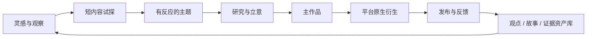
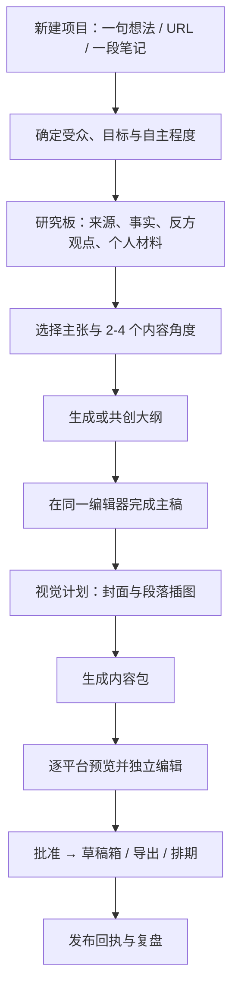
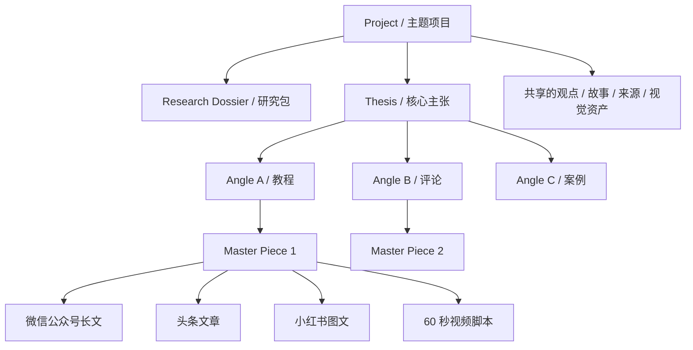

# MediaForge 产品重启处方

> 日期：2026-08-08
> 状态：R1–R9 已落实；R0 待真人主题验收，R10 及以后仍受决策闸门约束
> 适用范围：图文创作优先，视频随后；先证明个人创作者的完整闭环，再扩平台和自动化

## 0. 先给结论

MediaForge 不应该继续做成“把内部流水线每一步都做成菜单的自动化后台”，也不应该继续照着蚁小二一类分发产品换皮。

它应该成为一个 **AI 原生的个人创作工作台**：

> 把一个值得表达的主题，发展成有依据、有个人观点、有统一视觉的一篇主作品；再从主作品生成多个平台原生、仍可独立编辑的图文和视频版本；人在关键节点拍板，机器负责研究、改写、制图、适配、排期和复盘。

产品承诺可以压缩成一句话：

> **一个主题，一个创作项目，一套内容资产，多篇可发布产出。**

现阶段最重要的不是再加平台、数字人或自动发布能力，而是让你自己能在 30—60 分钟内完成一次“从想法到两个平台草稿”的高质量创作。

---

## 1. 当前现状：为什么功能很多，却完全用不起来

### 1.1 运行数据已经说明主循环没有闭合

2026-08-08 对本地 `state.db` 和运行配置的检查结果：

| 指标 | 当前值 | 暴露的问题 |
| --- | ---: | --- |
| 内容总数 | 31 | 已经跑过不少实验，不是“还没开始” |
| 丢弃 | 29（93.5%） | 生成质量或流程选择严重失衡 |
| 通过 | 2 | 极少内容进入可发布区 |
| 真正发布 | 0 | 端到端价值仍未被证明 |
| 数据回流记录 | 0 | “反馈学习”目前只是架构，不是产品能力 |
| 待发布 / 已取消 | 3 / 3 | 发布编排存在，但没有稳定交付 |
| 当前图片供应商 | `none` | UI 中的 AI 配图承诺无法兑现 |

账号健康状态也不完整：头条凭据检查通过；小红书依赖目录缺失；X 凭据文件缺失。配置却已打开 `publish.enabled: true`。这会给人一种“产品已经能发布”的错觉，而真实状态仍是实验性。

### 1.2 实际页面是在要求用户操作状态机

当前首页和侧栏更像一个企业运营后台：选题、内容、审核、发布、账号、数据、任务等十多个入口并列。自动创作又是一个固定六步向导，第一步没有 `selected` 选题就直接中断，要求用户先去另一个页面改变数据库状态。

这等于让创作者先理解系统内部的 `ingest → score → create → gate → review → schedule → publish`，再开始写作。用户想的是“我有一个想法，帮我把它做好”，系统给出的却是“请先推进流水线状态”。

### 1.3 手工创作和自动创作被错误地拆成两种产品

手工入口目前主要是标题、正文、栏目、平台和 Markdown 预览；自动入口是固定向导。两边都缺少真正的 AI 共创：

- 没有围绕主题持续存在的 AI 对话和上下文；
- 没有研究资料板、出处卡片、事实声明清单；
- 没有选中一段后“重写、压缩、补证据、换口吻、生成反方观点”；
- 没有在文章段落旁直接安排、生成、编辑插图；
- 没有版本对比和回退；
- 没有“这次我想自己多写一点 / 这次让 AI 多做一点”的控制。

正确模型不是“手工模式 vs 自动模式”，而是同一个项目里的 **自主程度滑杆**：

1. 我写，AI 只校对和查证；
2. 我和 AI 一起写；
3. AI 起草，我逐段审批；
4. AI 完成内容包，我只做最终审批。

### 1.4 创作依据太薄，质量门禁放得太晚

当前长文提示词主要从单条抓取来源生成 1500—3000 字文章，再放置若干 `[IMAGE: ...]` 标记。虽然有反幻觉约束，但没有先形成：

- 这个主题为什么值得写；
- 写给谁、解决什么问题；
- 核心主张与独特角度；
- 多来源证据和可追溯引用；
- 哪些是事实、哪些是判断、哪些仍不确定；
- 你的个人经验、故事和品牌观点。

因此，门禁只能在下游淘汰大量泛化稿件。93.5% 的丢弃率正是结果。质量应该在“研究—立意—大纲”阶段逐层建立，而不是全文生成后统一判死刑。

### 1.5 图像、视频和发布都是“有适配器，没创作体验”

- 技术规格写了多种图片 provider，但当前实现实际只支持 MiniMax，配置则为 `none`；用户期待的 GPT Image 2 尚未接入。
- 视频侧已经有引擎桥接、数字人和发布相关模块，但没有一个以脚本、分镜、镜头和字幕为核心的可编辑工作流。
- 发布侧投入较深，但 0 条真实发布、0 条指标回流，说明它被放到了错误的建设顺序上。

### 1.6 工程基线也未处于“随时可交付”状态

本次校验结果：

- Python：`1604 passed, 7 failed, 13 skipped`；失败集中在图片模型契约、预算前置检查、发布并发测试和缓存文件误报。
- 前端：`npm run build` 被 `Step3Script.vue` 的未使用变量阻断。

这不是当前“不能用”的主要根因，但意味着下一轮产品重做必须先恢复可重复的绿色基线，避免每次体验问题都和工程回归混在一起。

---

## 2. 真正的产品定义

### 2.1 第一目标用户

先只服务一个人：**有稳定专业领域、愿意表达个人观点、想持续经营多个内容平台的单人创作者**。

不是先服务 MCN，不是先服务几十账号的运营团队，也不是先服务纯流量搬运。先把你自己当成首位用户。

他的核心任务不是“运行一次 pipeline”，而是：

> 我有一些资料、观察或半成品想法，希望在保留个人判断和口吻的前提下，快速做成一套高质量、可持续复用、适合不同平台的内容资产。

### 2.2 北极星结果

第一阶段只看四个结果：

1. 每周至少完成 1 个主题项目；
2. 每个项目产出 1 篇主作品和至少 2 个可发布平台版本；
3. 从新建项目到两个平台草稿不超过 60 分钟；
4. 连续四周实际发布，并能把数据和人工复盘带回项目。

“生成了多少篇”“跑了多少次任务”“支持多少平台”不是北极星指标。

### 2.3 明确不做

在图文黄金路径稳定以前暂停：

- 新增更多发布平台；
- 多账号矩阵和团队权限；
- 评论私信、竞品监控等运营后台功能；
- 数字人和复杂视频模板；
- 无人值守真发布；
- 首页大屏、统计卡片和更多后台菜单；
- 为了“看起来成熟”继续复制某个产品的视觉表面。

---

## 3. 内容方法：把 Dan Koe 的生态理念变成产品结构

可借鉴的不是 Dan Koe 的文风，而是他的内容生产模型：先形成一个高质量的核心表达，再让长、中、短内容相互供养，逐渐形成可被连续阅读的“思想世界”。他也明确反对为每个平台重新发明一套完全不同的内容，而主张把真实、高质量的核心作品广泛传播。

MediaForge 可以把这个方法产品化成以下循环：



### 3.1 产品里的五个具体机制

1. **Idea Inbox**：随时保存一句观察、链接、图片、录音或半成品，不要求先选平台。
2. **想法评分**：不是只看热度，而是综合“我是否兴奋 × 受众是否在意 × 是否符合长期主题 × 是否有独特材料”。
3. **短内容试探**：先生成 3—5 个钩子或短观点，由人选择是否发布；真实反馈帮助选择长文主题。
4. **主作品优先**：主作品承载完整论证、个人故事和证据；其他产出引用它，而不是各自从零生成。
5. **内容世界**：把反复出现的概念、框架、故事、案例、论点和视觉风格沉淀为可复用资产，而不只是把旧文章堆在列表里。

参考：[Dan Koe 的 Content Ecosystem 2.0](https://letters.thedankoe.com/p/how-to-build-a-world-the-2-hour-content)。

---

## 4. 目标信息架构：从 13 个后台入口收敛到 6 个创作者入口

| 一级入口 | 回答的问题 | 主要对象 |
| --- | --- | --- |
| 今天 | 我现在最值得做什么？ | 待继续项目、待审批、待发布 |
| 灵感 | 我有哪些值得发展的想法？ | idea、素材、短内容试探 |
| 项目 | 这个主题怎样变成一套作品？ | 研究、主稿、视觉、衍生版本 |
| 资产 | 我过去有哪些观点和素材可复用？ | 论点、故事、案例、图片、模板 |
| 发布 | 什么时候发，发到哪里，是否成功？ | 草稿、日历、账号、回执 |
| 复盘 | 哪些主题、钩子和封面有效？ | 指标、人工总结、下一步建议 |

设置放到头像菜单；系统运行、日志、成本和内部状态机放进“开发者 / 运行状态”抽屉，不再占据普通创作导航。

### 4.1 首屏应该是什么

首屏不应该是紫色大横幅和一排统计卡，而应该是一个安静的继续工作界面：

- “继续：OpenCut 主题项目，主稿完成 72%”；
- “今天需要你决定：选择一个角度、批准两张插图、检查微信公众号预览”；
- 一个始终可见的“新建创作项目”按钮；
- 最近灵感和最近成稿；
- 只有在异常时才显示运行告警。

设计方向：**编辑部工作台，而不是 SaaS 管理后台**。建议界面变异度 4/10、动效 2/10、信息密度 6/10；中性纸张底色、清晰排版、少量状态色，以内容本身为视觉主体。成熟产品只能借交互模式，不能继续抄配色、横幅和卡片形状。

---

## 5. 核心体验：一个统一的“创作项目工作台”

### 5.1 黄金路径



### 5.2 工作台布局

建议以主稿编辑器为中心，而不是继续使用多页向导：

```text
┌ 项目标题 / 阶段 / 保存状态 / 自主程度 / 生成内容包 ───────────────┐
│ 左：研究与大纲        │ 中：主稿编辑器             │ 右：AI 与视觉计划 │
│ - 来源卡              │ - 块级正文                 │ - 对话上下文      │
│ - 事实/争议            │ - 选中文本快捷操作          │ - 封面/插图槽位   │
│ - 个人材料             │ - 引用与图片块              │ - 生成/编辑/换图  │
│ - 内容角度             │ - 评论、版本、恢复          │ - 品牌风格约束    │
├──────────────────────────────────────────────────────┤
│ 预览：主稿 | 微信公众号 | 头条 | 小红书 | 视频脚本               │
└──────────────────────────────────────────────────────┘
```

窄屏时三栏变为抽屉，不能把编辑区压到不可写。默认只显示与当前动作有关的信息。

### 5.3 AI 应该出现在动作旁边

可直接借鉴 beehiiv 的原则：AI 在编辑器内部完成起草、精简、扩写、换口吻和配图，而不是把用户送到另一个“AI 页面”。具体动作包括：

- 对全文：找角度、生成大纲、检查结构、统一声音；
- 对段落：重写、缩短、补例子、补反方观点、降低 AI 腔；
- 对句子：增强钩子、变清楚、查证；
- 对空白位置：插入故事、案例、数据卡、引用或图片；
- 对平台版本：解释“为何这样适配”，允许接受或撤销修改。

所有 AI 结果都应先以 diff 或建议形式出现，不能悄悄覆盖用户正文。参考：[beehiiv 的编辑器内 AI 工作流](https://www.beehiiv.com/features/artificial-intelligence)。

### 5.4 灵感与草稿必须分开

灵感阶段不应该强迫用户选择发布平台。Buffer 的 Ideas 也是平台无关的素材空间，直到想法成熟才转成具体平台草稿。MediaForge 应采用同样的对象边界：**Idea 是可能性，Project 是承诺，Variant 才是平台交付物**。参考：[Buffer Ideas 的对象和流转方式](https://support.buffer.com/article/589-creating-ideas-in-buffer)。

---

## 6. “一鱼多吃”的正确数据心智模型

当前系统的核心接近“一条 Topic → 一条 Content → 多个 derivative 文件”。这不足以表达“一个主题产生多篇不同角度的作品”。目标模型应该是：



建议的产品对象：

| 对象 | 作用 |
| --- | --- |
| Idea | 原始想法或素材，不承诺产出 |
| Project | 一个主题的长期工作空间，也是“一鱼”的边界 |
| Source / Claim | 来源与可追溯事实声明 |
| Thesis / Angle | 核心主张与不同表达角度 |
| Master Piece | 某个角度下的完整主作品 |
| Variant | 针对某平台重组后的可独立编辑版本 |
| Visual Asset | 封面、插图、图卡、镜头素材及其生成历史 |
| Publication | 一次交付尝试、平台回执和错误 |
| Learning | 数据与人工复盘形成的可复用结论 |

### 6.1 不立刻破坏现有契约

`TECH_SPEC.md` 已冻结数据库结构和 Adapter 签名。本轮处方不直接修改它们。

第一版可以用 `output/projects/<project_id>/project.json` 作为 sidecar manifest，引用现有 topic/content/publication ID，把多个现有 Content 聚合成 Project。等黄金路径跑通并确认对象边界后，再单独写 schema RFC 和迁移方案。这样不会为了一个尚未验证的 UI 概念提前改坏状态机。

---

## 7. GPT Image 2：把“能生图”升级为文章视觉导演

OpenAI 官方把 GPT Image 2 定位为高质量图像生成与编辑模型，并提供 generation 和 edit 端点。MediaForge 不应只加一个 provider 名字，而要提供完整的视觉工作流。参考：[GPT Image 2 官方模型文档](https://developers.openai.com/api/docs/models/gpt-image-2)。

### 7.1 项目级视觉圣经

每个 Project 先确定：

- 主色、辅助色、留白和构图偏好；
- 摄影 / 编辑插画 / 信息图 / 3D 等视觉语言；
- 人物是否出现、是否允许文字、禁用元素；
- 微信封面、头条封面、小红书卡片和视频画幅规则；
- 2—4 张参考图及其用途。

### 7.2 图片不是一次性文件，而是可编辑资产

每张图至少保存：用途、所对应段落、prompt、模型、尺寸、版本、参考图、成本、选择原因和用户评分。工作流应是：

1. AI 读文章后提出视觉计划；
2. 用户删改槽位和方向；
3. 一次生成少量候选；
4. 在候选上继续编辑，而不是每次从零抽卡；
5. 自动生成平台安全裁切和预览；
6. 用户批准后才进入 Variant。

### 7.3 接入验收标准

- 新增独立 `OpenAIImageProvider`，不改变调用方公共契约；
- 支持 `gpt-image-2` 的生成与编辑，密钥只来自环境变量 / `secrets/`；
- 生成、失败、成本和重试全部可审计；
- provider 未配置时，UI 明确显示“不可用”和修复入口，不再展示可点击的假能力；
- 一篇真实文章完成 1 张封面 + 2 张插图，并在微信公众号和头条预览中正确渲染；
- 人工给出“可直接发布”结论，才算完成，不以 API 返回 200 为完成。

---

## 8. 平台适配：共享思想，不共享同一份排版

一鱼多吃不是把同一段 Markdown 复制到所有平台。共享的是主张、证据、故事和视觉资产，平台版本可以重新组织：

| 平台 | 第一阶段产物 | 适配重点 |
| --- | --- | --- |
| 微信公众号 | 长文草稿 | 标题、摘要、段落节奏、引用、图文排版、封面 |
| 头条 | 长文草稿 / 导出 | 更直接的标题和开场、信息密度、相关推荐语境 |
| 小红书 | 后续图文卡片 | 单点承诺、短段落、卡片结构、可收藏性 |
| 微信视频号 | 后续 60—180 秒脚本 | 前 3 秒、口语节奏、字幕和竖屏分镜 |
| Bilibili | 后续中长视频脚本 | 章节、论证、屏幕素材和持续观看理由 |

每个 Variant 必须能独立编辑和锁定；重新生成主稿时，系统只能提示“上游有更新”，不能覆盖已经人工修改的平台稿。

---

## 9. 视频：在图文闭环后，用“编辑脚本”代替“配置引擎”

视频入口最终也应该属于同一个 Project，但第一阶段先不做。

目标交互借鉴 Descript 的核心心智：通过编辑文本来编辑音视频，底层媒体跟随脚本变化。MediaForge 的视频工作台应包括：

1. 从主作品选择一个视频角度；
2. 生成口语脚本和章节；
3. 自动拆成镜头卡：旁白、画面、字幕、素材、时长；
4. 用户像改文档一样改脚本；
5. 引擎只负责渲染预览；
6. 先低清、短片段预览，批准后再高成本渲染；
7. 导出或发布前进行人工确认。

参考：[Descript 的文本式音视频编辑](https://help.descript.com/hc/en-us/articles/15726742913933-Edit-like-a-doc)。

数字人只是某个镜头的渲染方式，不能再被当作产品主流程。

---

## 10. 分阶段重做路线

### Phase 0：止血与定义（2—3 天）

目标：得到一个可信基线和唯一验收剧本。

- 暂停新增功能和视觉换皮；
- 把前端 build 和 Python 测试恢复到绿色；
- 在真实发布验证前，建议把全局发布开关退回安全态；
- 选择一个你真的愿意发布的主题和真实账号；
- 写出“60 分钟完成一篇微信 + 头条图文”的逐步验收剧本；
- 区分实验数据、演示数据和真实内容，避免继续污染判断。

退出条件：同一条命令可启动；构建和测试全绿；验收剧本、样稿和目标读者明确。

### Phase 1：项目壳与导航重构（3—5 天）

目标：用户从想法进入项目，不再从状态机进入流水线。

- 新建 Project sidecar manifest；
- 收敛一级导航到“今天 / 灵感 / 项目 / 资产 / 发布 / 复盘”；
- 新建项目时可输入想法、URL、文件或粘贴正文；
- 设置受众、目标、品牌声音和自主程度；
- 旧的 ingest/score/gate/run 页面移入开发者抽屉，功能暂不删除。

退出条件：第一次使用者不看说明，3 分钟内能创建项目并知道下一步。

### Phase 2：图文共创黄金路径（1—2 周）

目标：在同一个工作台完成一篇有依据的主稿。

- 研究资料板：来源卡、摘录、事实声明、矛盾和待确认项；
- 立意：受众承诺、核心主张、反方观点、多个角度；
- 大纲与正文统一编辑器；
- 选中文本后的 AI 快捷动作；
- AI 建议以 diff 呈现，带撤销和版本；
- 质量检查前移到来源、主张、大纲和段落级；
- 人工可从空白写，也可让 AI 起草，不再分两个入口。

退出条件：用真实主题写出一篇你愿意署名的主稿；人工修改有保留，来源可追溯。

### Phase 3：图文视觉与双平台内容包（1 周）

目标：主稿变成真正可发布的微信和头条图文。

- 接入 GPT Image 2 provider；
- 项目视觉圣经、视觉计划、候选与编辑；
- 微信公众号和头条 Variant 独立可编辑；
- 平台预览使用真实宽度、字体和图片比例；
- 一键生成“内容包”，但逐项审批。

退出条件：完成 1 张封面、2 张插图、2 个平台稿；不用离开项目工作台即可审完。

### Phase 4：安全交付与四周实用性验证（至少 4 周）

目标：证明不是 demo。

- 第一优先使用微信公众号草稿箱 API 或安全导出；
- 头条先导出 / dry-run，再做真实账号发布；
- 每个平台单独连续验证至少 3 天；
- 保存平台回执、失败截图和恢复动作；
- 每周完成至少一个真实项目，共四个项目；
- 记录总耗时、人工改动量、发布成功率和主观质量。

退出条件：连续四周真实使用；至少 8 个平台稿发布；没有重复发布和静默覆盖。

### Phase 5：扩展一鱼多吃（1—2 周）

目标：从“一稿两发”升级为“一个主题多角度、多形态”。

- 同一 Project 建立 2—4 个 Angle；
- 增加小红书图文内容包；
- 把表现较好的短观点升级成长文，把长文再反哺短内容；
- 建立观点、故事、案例和视觉资产库；
- 提供“这个衍生版本来自哪些主张和段落”的追踪。

退出条件：一个真实主题产生至少 2 篇不同角度作品和 6 个可发布资产，内容不互相重复灌水。

### Phase 6：视频与反馈学习（之后）

目标：只扩展已经被证明的内容生态。

- 先做一个视频形态和一个平台；
- 脚本—分镜—预览—渲染—审批全程可编辑；
- 数据回流到主题、角度、钩子、封面和平台版本；
- AI 只能提出“以后可复用的结论”，由人确认后写入品牌与创作规则。

退出条件：同一 Project 的视频和图文都实际发布，并能用反馈指导下一个项目。

---

## 11. 可执行的第一批任务顺序

以下是产品重启顺序，不直接替代现有 `docs/TASKS.md`。确认方向后，应把它们拆成符合现有 TDD、契约红线和独立 commit 规则的正式任务。

| 顺序 | 任务 | 可验收结果 |
| ---: | --- | --- |
| R0 | 固定一条真实主题验收剧本 | 有输入素材、目标读者、样稿标准、两个目标平台 |
| R1 | 恢复工程绿色基线 | pytest、前端 build 全绿，启动命令唯一 |
| R2 | 定义 Project manifest v0 | 不改 DB schema，可聚合多个 content ID 和资产 |
| R3 | 重构导航与“今天”页 | 普通用户看不到内部阶段菜单，能直接继续项目 |
| R4 | 新建项目与 Idea Inbox | 一句话、URL、文件均能无平台约束地保存和转项目 |
| R5 | 项目研究板 | 每项重要事实可追溯到来源，冲突显式显示 |
| R6 | 统一共创编辑器 | 人写/AI 写在同一路径，AI 改动可比较和撤销 |
| R7 | 视觉计划 + GPT Image 2 | 一篇真实稿完成封面与两张插图，版本和成本可查 |
| R8 | 微信/头条 Variant 与真实预览 | 两份稿可独立编辑，上游更新不覆盖人工修改 |
| R9 | 内容包审批 | 一次看到所有文字、图片、平台检查项并逐项批准 |
| R10 | 微信草稿 / 头条安全交付 | 有平台回执，失败可恢复，无重复发布 |
| R11 | 四周真人使用实验 | 4 个项目、8 个平台稿、耗时和修改量完整记录 |
| R12 | 小红书内容包 | 只有 R11 达标后开始 |
| R13 | 文本式视频工作台 | 只有图文闭环稳定后开始 |
| R14 | 数据反馈与内容世界 | 有真实数据后才形成建议，不用模拟指标自嗨 |

每个任务的验收必须包含一次浏览器中的真人路径，不再以“API 存在、测试通过、页面能打开”代替“产品可用”。

---

## 12. 现在如何先把它用起来

在重做开始前，不建议继续尝试当前“全自动创作 → 全自动发布”。把现有系统临时当作后端工具箱：

1. 选一个你本周真的要发的主题，不用批量 ingest；
2. 手工整理 3—5 个可靠来源和你自己的观点；
3. 用手工创作入口生成一篇主稿，重点验证正文质量；
4. 配图暂时在外部用 GPT Image 2 完成，记录 prompt 和选择理由；
5. 只生成微信和头条两个版本；
6. 先复制 / 导出到平台草稿箱，人工检查并发布；
7. 把所有卡点、离开系统的动作和人工修改记录下来；
8. 这些记录就是 R0 的验收剧本，也是接下来真正该开发的内容。

这不是长期方案，而是尽快把“我想要的产品”从抽象愿望变成一条真实、可观察的工作路径。

---

## 13. 三个决策闸门

后续每次扩范围前，只问三个问题：

### 闸门 A：创作质量

这篇内容我愿意署自己的名字发布吗？如果不愿意，不应继续做更多衍生版本。

### 闸门 B：创作效率

这个功能减少了我的思考外劳动，还是增加了设置、切页和等待？增加簿记的功能不能进入主流程。

### 闸门 C：真实闭环

它是否被真实账号连续使用并产生可回收的结果？没有真实交付的“平台支持”只能标记为实验能力。

---

## 14. 最终形态

如果按这个顺序做，MediaForge 最终不是“又一个 AI 写作器”，也不是“又一个多平台分发后台”。它会形成更难替代的东西：

- 它知道你长期关心什么、相信什么、如何表达；
- 它把来源、观点、故事和视觉积累成你的内容世界；
- 它既能陪你从零创作，也能在你忙时提高自主程度；
- 它把一份真正高质量的思考，变成多个平台原生的作品；
- 它记得哪些主题、角度、钩子和封面对你的受众有效；
- 但在署名、事实、审美和真实发布上，最后决定权始终属于你。

这才是“全自动”值得追求的含义：不是把人从创作中删除，而是把人从重复劳动、格式适配和维护成本中解放出来。
