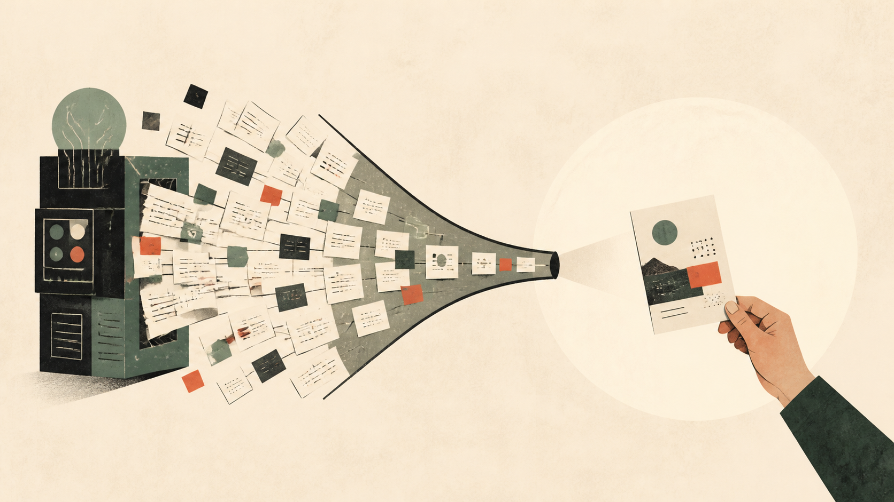

# 1695 个测试全绿，产品却不敢用：AI 开发最容易漏掉最后一公里

> 自动化测试全绿，为什么我仍不愿意用自己的 AI 产品？真正的瓶颈不是生成，而是事实边界、人工判断和真实流程。

## 测试全绿，不等于可用

2026 年 8 月 9 日，我在当前仓库执行全量测试：1695 个通过，13 个跳过。这是工程回归证据，不是产品可用性的证明。测试验证的是实现，不验证价值。

这个结果让我停下来思考一个问题：当我把一个 AI 内容流水线做到全绿，我为什么仍然不愿意拿它完成一篇真实文章？

## 生产成本压低后，什么变贵了

我的判断是：当 AI 把代码和内容的生产成本压低后，真正稀缺的会变成明确意图、设定质量标准、核查事实、做取舍，以及亲自走完真实工作流。

这不是普遍定律，而是我在这个项目开发过程中的个人判断。如果一个任务目标明确、反馈快速、验收可以自动化，AI 仍然可能让产出和价值同时提升。我的流水线就是这种场景的一个例子。

但当我面对一篇真正想写的文章时，问题变了。我不缺生成能力，我缺的是决定这篇文章为什么要存在、为谁而写、在什么边界内验证假设。这些无法被自动化测试覆盖。

## 评测告诉我们什么，也告诉我们不什么

OpenAI 在 Evals 的讨论中指出，通用或前沿评测无法覆盖一个具体业务工作流的全部细节，应该把"什么算好"具体化，并在真实条件下测量和改进。这让我反思自己的测试策略。

我写了一千六百多个测试用例，它们告诉我代码是否按预期运行。但它们没有告诉我，这篇文章是否值得写，读者是否愿意读，事实是否经得起推敲。情境化评测当然更有用，但如果定义不当，它也会把错误目标测得很精确。

这就是我现在面对的问题：测试告诉我流水线是正确的，但不告诉我它是否在生产真实有价值的东西。

## 效率数据并不总是正面的

METR 在 2025 年 7 月发布了一项随机对照实验，研究早期 AI 工具对资深开源开发者生产力的影响。结果出人意料：16 名熟悉大型开源仓库的开发者，在使用 AI 工具后完成任务平均慢了 19%。

我必须强调这个结果的边界。这是特定人群、特定仓库与早期 2025 工具的快照，不能外推为"AI 让大多数开发者变慢"。到 2026 年，模型、智能体脚手架和用户经验都已变化，新一轮研究可能出现不同结果。

但这个研究仍然提醒了我一件事：工具能力的提升不等于任务效率的提升。当我用 AI 辅助构建内容流水线时，我花更多时间在设定边界、审查输出、纠正方向上。这些时间成本在传统的"AI 生成内容"叙事里经常被忽略。

## 放大器，不是万能药

DORA 2025 将 AI 描述为放大器：它会同时放大组织原有的优势与弱点，回报取决于底层系统而不只是工具本身。

我把这个框架用于个人产品是启发性的类比，不是因果证明。更强的 AI 工具仍可能直接提高个体产出，底层系统并非唯一变量。

但我的经验支持这个比喻。我的流水线确实放大了一些东西：我过去手动写文章时的低效被放大了，但我的意图模糊和事实核查不足同样被放大了。当生成变得便宜，这些问题的代价变得更高，因为它们不再被繁琐的生产过程自然缓解。

## 内容生态的方法论问题

Dan Koe 提出过一个内容生态方法：先完成一篇高质量、真实的核心长文，再将其重新编排到不同平台。重点是长期作品体系，而不是为每个平台凭空生产互不相关的内容。

这是成熟创作者的方法论，仍需结合中文平台分发习惯验证。不同平台确有独特语境，简单复制同一稿件也可能降低效果。

但我的项目恰好在这个方法上遇到了瓶颈。我可以自动化重新编排、自动分发、自动追踪反馈，但我无法自动化那篇核心文章。自动化流水线放大了我在"重新编排"环节的效率，同时也暴露了我在"核心创作"环节的缺失。

## 我不打算给一个确定的结论

这个项目仍处于草稿阶段。我写下的这些判断基于个人经验，不是普遍定律。我的测试全绿不代表内容生产已经就绪，我的犹豫也不代表 AI 辅助创作没有价值。

真正需要回答的问题是：当生产成本趋近于零时，什么构成了价值？我的流水线还没有答案。但它至少正确地提出了这个问题。

这是我为独立开发者和单人创作者写下的一篇草稿。如果你有类似的经验或不同的看法，欢迎在评论区讨论。这篇稿子本身也还在迭代中，它会随着我的理解变化而更新。

---

**事实边界**
- 当前仓库在 2026-08-09 的全量测试结果是 1695 passed、13 skipped；这只能证明已有自动化断言通过。
- METR 的随机对照实验中，16 名熟悉大型开源仓库的开发者使用早期 2025 AI 工具完成任务平均慢 19%。
- DORA 2025 把 AI 描述为放大器：它会放大组织或工作系统原有的优势与弱点。
- OpenAI 指出，前沿或通用评测无法揭示一个具体业务工作流要求的全部细节，因此需要情境化评测。
- Dan Koe 的内容生态方法强调先写一篇真实、高质量的核心作品，再将其重新编排到多个平台。
- 我的判断是：当 AI 把代码和内容的生产成本压低后，真正稀缺的会变成明确意图、设定质量标准、核查事实、做取舍，以及亲自走完真实工作流。

---

## 参考资料

- [METR：Early-2025 AI Experienced OS Dev Study](https://metr.org/blog/2025-07-10-early-2025-ai-experienced-os-dev-study/)
- [DORA：2025 State of AI-assisted Software Development](https://dora.dev/research/2025/dora-report/)
- [OpenAI：Evals drive the next chapter of AI](https://openai.com/index/evals-drive-next-chapter-of-ai/)
- [Dan Koe：The 2-Hour Content Ecosystem](https://letters.thedankoe.com/p/how-to-build-a-world-the-2-hour-content)
